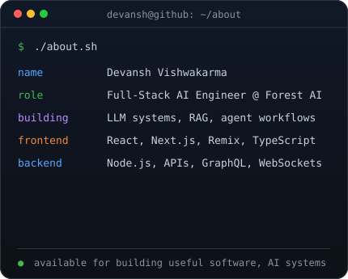
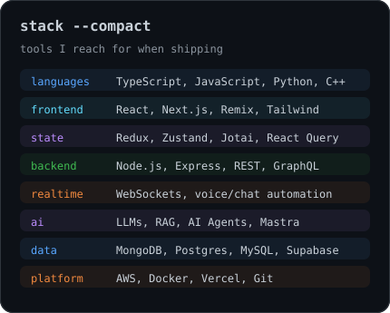

<h3><code>devansh@github ~ $ ./about.sh</code></h3>

<table>
<tr>
<td valign="top"></td>
<td valign="top"></td>
</tr>
</table>

### :fire: Streaks 
  

 
<h3><code>devansh@github ~ $ ./connect.sh</code></h3>

<b>Software Developer · ForestAI</b>

 

